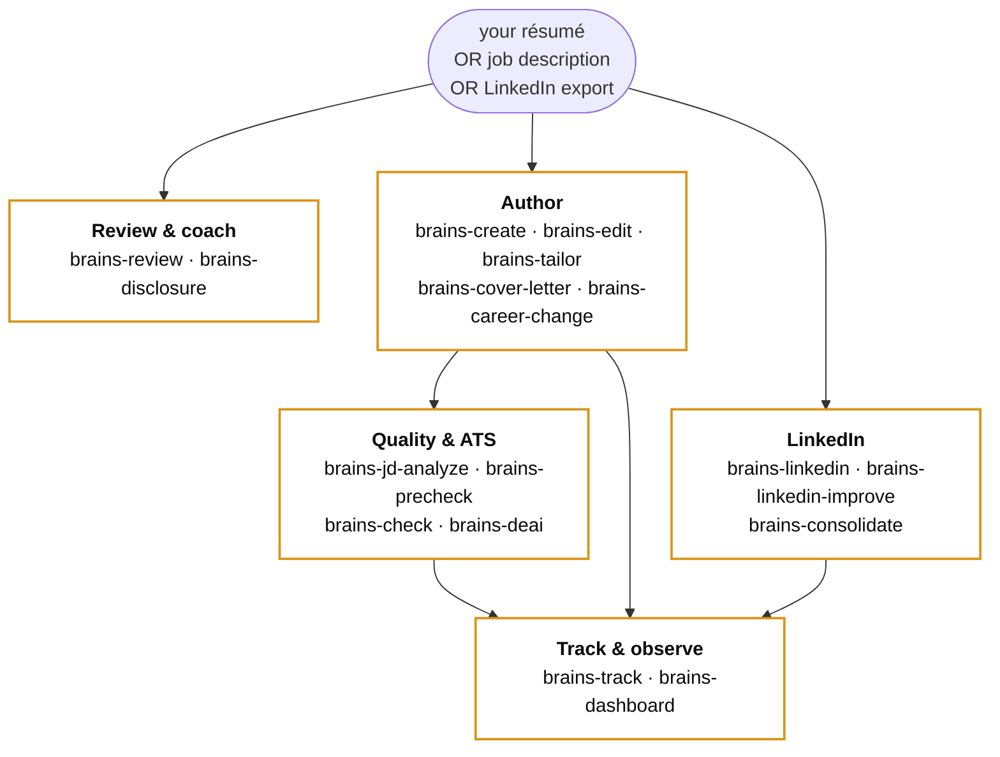

<div align="center">

<picture>
  <source media="(prefers-color-scheme: dark)" srcset="https://raw.githubusercontent.com/shard-BRAINS/.github/main/profile/brand-mark-dark-bg.png">
  
</picture>

# BRAINS Resume Skill

### A neurodivergence-aware résumé, cover-letter, and LinkedIn toolkit.

<br />

[](CHANGELOG.md)
[](STATUS.yml)
[](LICENSE)
[](https://discord.gg/BEmTXXscBr)
[](https://github.com/shard-BRAINS)

<br />

[Install ↓](#install) &nbsp;·&nbsp; [Workflows ↓](#workflows) &nbsp;·&nbsp; [Dashboard ↓](#dashboard) &nbsp;·&nbsp; [Privacy ↓](#privacy)

</div>

---

A Claude Code skill that helps neurodivergent and autistic people review, create, customise, and tailor résumés and cover letters — with cross-cutting awareness of the bias patterns that filter neurodivergent candidates out of automated screening and human review.

> **Reliable, affirming, inclusive.**

**An Incubator project from [BRAINS](https://github.com/shard-BRAINS) — built by neurodivergent minds, for neurodivergent people.**

---

## Status

| | |
|---|---|
| **Current** |  per-JD output folders, traceable artifact UIDs |
| **In flight** |  disclosure framework polish · target 2026-07-15 |

For the full version history, see [CHANGELOG.md](CHANGELOG.md).

---

## What it does

| Workflow | Status |
|---|---|
| **Résumé review** — analyses an existing résumé, flags ND-bias risks and ATS formatting issues, produces a plain-language coaching report |  |
| **Disclosure coaching** — guided decision framework for whether, when, and how to disclose neurodivergent identity at each hiring stage |  |
| **Create from scratch** — builds a résumé via a structured interview |  |
| **Edit / customise** — improves a résumé without targeting a specific job description |  |
| **Tailor to a JD** — customises a résumé to a specific role, with keyword coverage reporting |  |
| **Cover letter** — drafts a three-paragraph cover letter calibrated to the tailored résumé and JD |  |
| **LinkedIn ingestion** — parses a LinkedIn ZIP export as source material; third-party PII auto-excluded |  |
| **Career-change translation** — translates experience from one domain into another with an explicit skills-bridge |  |
| **Pre-submit check** — ATS-safety + ND-bias + integrity pass on a final résumé and cover letter |  |

---

## Workflow shape



---

## Install

### One-line installers (recommended)

**Windows** (Command Prompt or PowerShell):

```
.\install\install.cmd
```

The wrapper handles PowerShell's default execution policy automatically — no system setting changed. To invoke PowerShell directly:

```powershell
powershell -ExecutionPolicy Bypass -File .\install\install.ps1
```

**macOS / Linux:**

```bash
bash install/install.sh
```

### Manual install (fallback)

```bash
# 1. Clone
git clone https://github.com/shard-BRAINS/BRAINS-resume-skill.git
cd BRAINS-resume-skill

# 2. Create + activate a virtual environment
python -m venv .venv
#    Windows:
.venv\Scripts\activate
#    macOS / Linux:
source .venv/bin/activate

# 3. Install with dev dependencies
pip install -e ".[dev]"
```

**Install the skill bundle for Claude Code** — copy or symlink:

```bash
# Copy (most users)
cp -r . ~/.claude/skills/brains-resume/

# Symlink (edits take effect immediately)
ln -s "$(pwd)" ~/.claude/skills/brains-resume
```

**Windows directory junction:**

```powershell
New-Item -ItemType Junction -Path "$env:USERPROFILE\.claude\skills\brains-resume" -Target (Get-Location).Path
```

---

## Workflows

| Command | What it does |
|---|---|
| `/brains-review [path]` | Audit a résumé for ND-bias, ATS-safety, and integrity issues |
| `/brains-disclosure` | Walk through the disclosure-decision framework |
| `/brains-create` | Build a résumé from scratch via interactive interview |
| `/brains-edit [path]` | Apply review recommendations; produces a clean ATS-safe rewrite |
| `/brains-tailor [résumé] [jd]` | Tailor a résumé to a specific job description |
| `/brains-cover-letter [résumé] [jd]` | Generate a matched cover letter |
| `/brains-career-change [target]` | Translate experience into a new domain |
| `/brains-jd-analyze [jd]` | Analyse a job description for ND-relevant signals (red flags, masking cost, evidence of flex, role-fit score) |
| `/brains-precheck [résumé] [jd]` | Six-question coaching pass before submitting an application; registers it in the tracker |
| `/brains-check [résumé] [letter]` | Final pre-submit ATS + bias + integrity pass |
| `/brains-deai` | Scan résumé / cover-letter / LinkedIn text for AI-tell signals; 0–100 score with rewrite suggestions |
| `/brains-linkedin [zip-path]` | Ingest a LinkedIn export (third-party PII auto-excluded) |
| `/brains-linkedin-improve` | Rewrite a LinkedIn profile (Headline / About / Experience / Skills) using the ND-aware framework |
| `/brains-consolidate` | Detect inconsistencies between a résumé and a LinkedIn profile and propose resolutions |
| `/brains-track [command]` | Manage the application tracker — add applications, log outcomes, view pipeline |
| `/brains-dashboard` | Launch the local Streamlit dashboard in a browser |

---

## Choosing a template

The skill ships **four résumé templates** and **two cover-letter templates**. All are ATS-safe; the choice is about narrative shape.

| Résumé template | Best for |
|---|---|
| `chronological` (default) | Linear career history with recent relevant experience |
| `functional` | Career-changers, employment gaps, skills-led story |
| `hybrid` | Career pivots with relevant transferable skills |
| `executive` | Senior roles, 15+ years experience, board / leadership framing |

| Cover-letter template | Best for |
|---|---|
| `formal-business` (default) | Traditional industries, regulated sectors |
| `modern-clean` | Tech / startup contexts |

The skill walks you through template selection during create / edit / tailor. See `references/template-selection.md` for the full decision tree, including the ND framing on the functional-template tradeoff.

---

## Tracking applications

The skill includes an **opt-in** application tracker stored locally at `~/.brains-resume/tracker.db` (SQLite). The tracker is created on first use; if you never run `/brains-track` or `/brains-precheck`, the database is never created.

The tracker carries:

- Résumé versions (with focus-area tags and tailored-from lineage)
- Job descriptions (with analyzer findings)
- Cover letters (linked to résumé + JD)
- Applications (with channel, agency, recruiter contact)
- Outcomes (callback, interview, offer, rejection, etc.)

From these you can query:

- This-week pacing vs your self-defined healthy weekly application rate
- Per-template efficacy (which template + JD combinations are converting)
- Open applications by company or recency
- Duplicate-application detection (prevents accidental re-application)

Use `/brains-track summary` for a pipeline view, `/brains-track update <id> <event-type>` to log outcomes, and `/brains-track healthy-rate` to set the application pace that fits your sensory bandwidth — the skill never tells you what that number should be.

---

## Dashboard

The skill ships a local **Streamlit dashboard**. After `pip install -e .`, launch from any terminal:

```
brains-resume-dashboard
```

Opens at `http://localhost:8501`. Press **Ctrl+C** in the launch terminal to stop.

### What you get

- **Overview** — pipeline funnel, summary tiles, sparkline trends, idle-state callouts, pending-callbacks panel
- **Résumés / Cover Letters / JDs** — tagged tables with focus areas, AI-signal score per text artifact, links to source files
- **Applications** — filterable table by company / channel / status / date
- **Analytics** — efficacy by template and channel
- **Pacing** — this-week count vs your self-defined healthy weekly rate, with sensory-load notes journal
- **Workflows** — all slash commands as cards, grouped into Résumé / JD & application / LinkedIn & coaching
- **Inline action buttons** on Résumés, Cover Letters, JDs, and Applications — pick a row, run the workflow directly
- **In-dashboard validators** — de-AI scan, JD analyze, tracker CRUD, consolidation diff handoff, final composite check, review preview — no Claude Code roundtrip
- **Clipboard hand-off** for LLM-heavy commands — click *"Copy /brains-X"* → paste into Claude Code chat. Optional audit log at `~/.brains-resume/handoffs/`.

The dashboard is **Incubator Blue** accented with **Gold Deep** delta callouts, Atkinson Hyperlegible body type, dark theme. Runs entirely on localhost — no telemetry, no outbound network. Read-only except for the sidebar profile editor and outcomes logging.

---

## Output organisation

All résumés and cover letters produced by the skill land in:

```
~/.brains-resume/outputs/<JD-folder>/
```

…with a deterministic filename pattern. See [`SKILL.md`](SKILL.md) § File organization for the full convention.

---

## Claude Desktop / claude.ai

A ready-to-import Claude Project bundle is at:

```
dist/brains-resume-claude-project.zip
```

Full setup instructions: [`docs/claude-project-setup.md`](docs/claude-project-setup.md).

---

## Usage

### Résumé review

Paste or attach your résumé and ask Claude to review it:

```
Review my résumé for ND-bias risks and ATS issues.
```

…or simply paste your résumé content — the skill defaults to a review workflow when it receives résumé content.

### Disclosure coaching

```
I'm applying for a role and I'm not sure whether to disclose that I'm autistic. Can you walk me through the decision?
```

The skill runs the full disclosure decision framework — covering factors, timing, and downstream talking points — and produces a worksheet you can refer back to.

### All other workflows

Use the slash commands listed above, or describe your goal in plain language — the skill router selects the right workflow automatically.

---

## Privacy

**Six unconditional guarantees — no configuration option overrides them:**

1. Output artifacts go to a user-chosen output directory (default `./output/` in your working directory). Nothing is written into the skill bundle.
2. The skill ships a `.gitignore` template that excludes the output folder and common résumé filenames, so you do not accidentally commit private content to version control.
3. On first use per session, the skill shows a plain-language notice that your résumé content is processed by Claude within that session only.
4. The LinkedIn ZIP parser extracts only your own data. It explicitly skips `Connections.csv`, `messages.csv`, `Invitations.csv`, and any file containing data about other people. It logs which files it skipped.
5. The skill does not persist data between sessions. Disclosure-stance choice, employer details, salary expectations, and all résumé content are ephemeral to the session.
6. No telemetry, no analytics, no phone-home.

---

## Contributing

Contributions are welcome. Read [`CONTRIBUTING.md`](CONTRIBUTING.md) before opening a pull request — it covers identity-first language requirements, the code of conduct, and how to propose new features or changes to the ND-bias catalog.

Want to propose a related project under the BRAINS Incubator? Email **[info@brainscertified.com](mailto:info@brainscertified.com?subject=Incubator%20application%20%E2%80%94%20%5Byour%20name%5D)** — see the [org landing page](https://github.com/shard-BRAINS) for the application template.

---

## Licence

MIT — see [LICENSE](LICENSE).

---

<div align="center">

<br />

**AI that works for every mind.**

<br />

[](https://github.com/shard-BRAINS)

</div>
