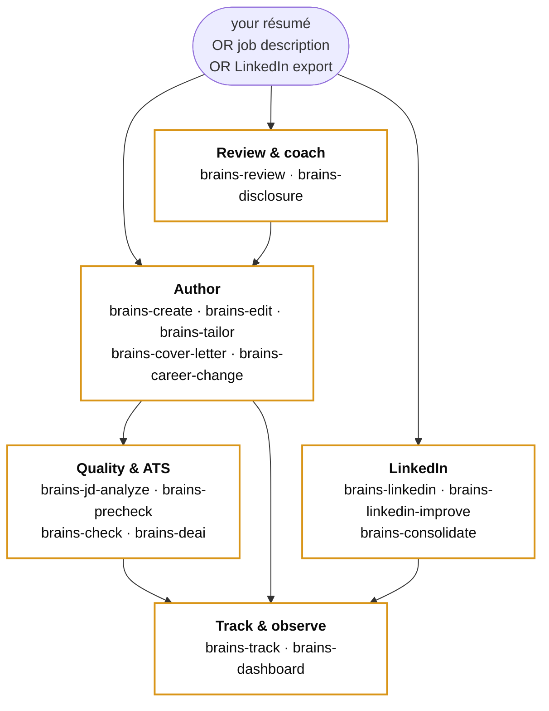

<!-- markdownlint-disable-file MD041 MD001 -->
<div align="center">

<picture>
  <source media="(prefers-color-scheme: dark)" srcset="https://raw.githubusercontent.com/shard-BRAINS/.github/main/profile/brand-mark-dark-bg.png">
  
</picture>

# BRAINS Resume Skill

### A neurodivergence-aware résumé, cover-letter, and LinkedIn toolkit

<br />

[](CHANGELOG.md)
[](STATUS.yml)
[](https://github.com/shard-BRAINS/BRAINS-template-repo)
[](LICENSE)
[](https://discord.gg/BEmTXXscBr)
[](https://bsky.app/profile/brainscertified.com)
[](https://github.com/shard-BRAINS)

<br />

<a href="https://github.com/shard-BRAINS/BRAINS-template-repo" title="Meets the BRAINS standard floor"></a>

<br />

[Install ↓](#install) &nbsp;·&nbsp; [Workflows ↓](#workflows) &nbsp;·&nbsp; [Dashboard ↓](#dashboard) &nbsp;·&nbsp; [Privacy ↓](#privacy)

</div>

---

<!-- readability: target grade 8 (public copy) -->

A Claude Code skill for neurodivergent job-seekers. It helps you review, write, edit, and tailor résumés and cover letters. It also spots bias patterns that screen out ND candidates — in software, and in human review.

> **Reliable, affirming, inclusive.**

**An Incubator project from [BRAINS](https://github.com/shard-BRAINS) — built by neurodivergent minds, for neurodivergent people.**

---

## Status

| | |
|---|---|
| **Current** |  disclosure framework polish — candidate-linked sessions, auto-apply downstream |
| **Recent** |  resume-first onboarding ·  dashboard orchestration + playbooks ·  multi-candidate support |

For the full version history, see [CHANGELOG.md](CHANGELOG.md).

---

## What it does

| Workflow | Status |
|---|---|
| **Résumé review** — checks an existing résumé. Flags ND-bias risks and ATS issues. Returns a plain-language coaching report. Reads your landed disclosure preference and flags inconsistencies. |  |
| **Disclosure coaching** — guided decision framework. Covers whether, when, and how to share neurodivergent identity at each hiring stage. Outcomes are persisted per candidate and respected by downstream workflows. |  |
| **Create from scratch** — builds a résumé via a structured interview. |  |
| **Edit / customise** — improves a résumé without targeting a specific job. |  |
| **Tailor to a JD** — adapts a résumé to a specific role. Reports keyword coverage. Reads and applies your landed disclosure preference. |  |
| **Cover letter** — drafts a three-paragraph cover letter to match the tailored résumé and JD. Reads and applies your landed disclosure preference. |  |
| **LinkedIn ingestion** — reads a LinkedIn ZIP export. Auto-skips third-party PII. |  |
| **Career-change translation** — translates experience from one domain into another. Builds a clear skills-bridge. |  |
| **Pre-submit check** — ATS, ND-bias, and integrity pass on a final résumé and cover letter. |  |
| **Multi-candidate support** — one install supports many candidate records. Each candidate has their own JDs, résumés, tracker rows, disclosure history, and dashboard layout. Switch from the sidebar. |  |
| **Dashboard orchestration** — Home tab is a customizable widget canvas with five guided playbooks (Apply to a job, Build a base résumé, Improve a résumé, Refresh LinkedIn, Career change). |  |

---

## Workflow shape



The **Review & coach** bucket feeds the **Author** bucket — disclosure-coaching outcomes are persisted per candidate (v2.3+) and read automatically by every downstream authoring workflow.

---

## Install

### One-line installers (recommended)

**Windows** (Command Prompt or PowerShell):

```text
.\install\install.cmd
```

The wrapper handles the default PowerShell execution policy. No system setting is changed. To call PowerShell directly:

```powershell
powershell -ExecutionPolicy Bypass -File .\install\install.ps1
```

**macOS / Linux:**

```bash
bash install/install.sh
```

### Manual install (fallback)

```bash
# 1. Clone
git clone https://github.com/shard-BRAINS/BRAINS-resume-skill.git
cd BRAINS-resume-skill

# 2. Create + activate a virtual environment
python -m venv .venv
#    Windows:
.venv\Scripts\activate
#    macOS / Linux:
source .venv/bin/activate

# 3. Install with dev dependencies
pip install -e ".[dev]"
```

**Install the skill bundle for Claude Code** — copy or symlink:

```bash
# Copy (most users)
cp -r . ~/.claude/skills/brains-resume/

# Symlink (edits take effect right away)
ln -s "$(pwd)" ~/.claude/skills/brains-resume
```

**Windows directory junction:**

```powershell
New-Item -ItemType Junction -Path "$env:USERPROFILE\.claude\skills\brains-resume" -Target (Get-Location).Path
```

---

## Workflows

| Command | What it does |
|---|---|
| `/brains-review [path]` | Audit a résumé for ND-bias, ATS-safety, and integrity issues |
| `/brains-disclosure` | Walk through the disclosure-decision framework. Outcome is recorded against the active candidate. |
| `/brains-create` | Build a résumé from scratch via interactive interview |
| `/brains-edit [path]` | Apply review notes; produce a clean ATS-safe rewrite |
| `/brains-tailor [résumé] [jd]` | Tailor a résumé to a specific job description. Applies your landed disclosure preference. |
| `/brains-cover-letter [résumé] [jd]` | Generate a matched cover letter. Applies your landed disclosure preference. |
| `/brains-career-change [target]` | Translate experience into a new domain |
| `/brains-jd-analyze [jd]` | Analyse a job description for ND-relevant signals (red flags, masking cost, evidence of flex, role-fit score) |
| `/brains-precheck [résumé] [jd]` | Six-question coaching pass before submit. Registers the application in the tracker. |
| `/brains-check [résumé] [letter]` | Final pre-submit ATS, bias, and integrity pass |
| `/brains-deai` | Scan résumé / cover letter / LinkedIn text for AI-tell signals. 0–100 score with rewrite hints. |
| `/brains-linkedin [zip-path]` | Read a LinkedIn export. Third-party PII is auto-excluded. |
| `/brains-linkedin-improve` | Rewrite a LinkedIn profile (Headline / About / Experience / Skills) using the ND-aware framework |
| `/brains-consolidate` | Spot gaps between a résumé and a LinkedIn profile. Propose fixes. |
| `/brains-track [command]` | Manage the application tracker — add, log outcomes, view pipeline |
| `/brains-dashboard` | Launch the local Streamlit dashboard in a browser |

---

## Choosing a template

The skill ships **four résumé templates** and **two cover-letter templates**. All are ATS-safe. The choice is about narrative shape.

| Résumé template | Best for |
|---|---|
| `chronological` (default) | Linear career history with recent relevant experience |
| `functional` | Career-changers, employment gaps, skills-led story |
| `hybrid` | Career pivots with relevant transferable skills |
| `executive` | Senior roles, 15+ years experience, board / leadership framing |

| Cover-letter template | Best for |
|---|---|
| `formal-business` (default) | Traditional industries, regulated sectors |
| `modern-clean` | Tech / startup contexts |

The skill walks you through template choice during create, edit, or tailor. See `references/template-selection.md` for the full decision tree.

---

## Tracking applications

The tracker is a local SQLite file at `~/.brains-resume/tracker.db`. It is built the first time you use it. Everything stays on your machine — no telemetry, no outbound network.

The tracker holds:

- **Candidates** — name, email, focus areas, healthy weekly rate, career-intent profile (v2.0+)
- **Résumé versions** — focus-area tags, tailored-from lineage, drift snapshots
- **Job descriptions** — analyzer findings, per-JD output folders
- **Cover letters** — linked to résumé + JD
- **Applications** — channel, agency, recruiter contact
- **Outcomes** — callback, interview, offer, rejection, etc.
- **Disclosure sessions** — six-factor answers, landed strength, worksheet artifact UID (v2.3+)
- **Playbook runs** — guided journey progress, step-by-step state (v2.1+)

From these you can ask:

- This-week pace vs your healthy weekly rate
- Per-template results — which template and JD pairs convert
- Open applications by company or by date
- Repeat-application checks — stop accidental re-apply
- The active candidate's landed disclosure preference — downstream workflows respect this automatically

Use `/brains-track summary` for a pipeline view. Use `/brains-track update <id> <event-type>` to log outcomes. Use `/brains-track healthy-rate` to set the pace that suits you. The skill never tells you what that number should be.

---

## Dashboard

The skill ships a local **Streamlit dashboard**. After `pip install -e .`, launch from any terminal:

```text
brains-resume-dashboard
```

Opens at `http://localhost:8501`. Press **Ctrl+C** to stop.

### Eight tabs (v2.x)

- **Home** — the orchestration surface. Customizable widget canvas: playbook cards, in-progress runs, computed next-actions worklist, pipeline mini-board, pacing / drift / library-count tiles, quick-launch, recent outcomes. Customize mode lets each candidate add, remove, and reorder widgets; the layout persists per candidate.
- **Résumés / Cover Letters / JDs** — tagged tables with focus areas, an AI-signal score per text, links to source files; inline action buttons per row
- **Applications** — table filtered by company, channel, status, or date
- **Analytics** — results by template and channel
- **Pacing** — this-week count vs your self-defined healthy weekly rate. Includes a sensory-load notes journal.
- **Drift** — baseline-vs-current résumé diff with per-candidate scoping
- **Disclosure** *(v2.3+)* — record disclosure-coaching outcomes against the active candidate, view past sessions, generate branded worksheets

### Multi-candidate

The sidebar exposes a candidate picker. One install supports many candidate records — every tab scopes to the active candidate, every JD / résumé / disclosure session lives under that candidate's record. Switch any time from the sidebar; nothing leaks across.

### How the dashboard talks to Claude Code

- **In-dashboard validators** — de-AI scan, JD analyze, tracker CRUD, disclosure recording, consolidation diff, final composite check, review preview. No Claude Code round-trip.
- **Clipboard hand-off** for LLM-heavy commands — click *"Copy /brains-X"* and paste into Claude Code. Optional audit log at `~/.brains-resume/handoffs/`.

The dashboard uses Incubator Blue with Gold Deep accents. Body text is Atkinson Hyperlegible. The theme is dark. It runs on localhost only. No telemetry. No outbound network. Mutable state is the candidate record, the tracker (outcomes), the disclosure_sessions table, and the per-candidate Home layout. Résumé / cover-letter / JD content is read-only.

---

## Output organisation

Résumés and cover letters land in:

```text
~/.brains-resume/outputs/<JD-folder>/
```

Disclosure worksheets land in:

```text
~/.brains-resume/outputs/disclosure/<candidate-slug>/
```

Both follow a fixed filename pattern with traceable artifact UIDs. See [`SKILL.md`](SKILL.md) § File organization for the full convention. Override the outputs root via the `BRAINS_OUTPUTS_DIR` env var.

---

## Claude Desktop / claude.ai

A ready-to-import Claude Project bundle is at:

```text
dist/brains-resume-claude-project.zip
```

Full setup instructions: [`docs/claude-project-setup.md`](docs/claude-project-setup.md).

---

## Usage

### Résumé review

Paste or attach your résumé and ask Claude to review it:

```text
Review my résumé for ND-bias risks and ATS issues.
```

Or paste your résumé content. The skill picks the review workflow by default when it sees résumé content.

### Disclosure coaching

```text
I'm applying for a role and I'm not sure whether to disclose that I'm autistic. Can you walk me through the decision?
```

The skill runs the full disclosure framework — factors, timing, follow-up talking points — and returns a branded worksheet (markdown + PDF) under `~/.brains-resume/outputs/disclosure/<candidate>/`. From v2.3, the landed strength is recorded against the active candidate's tracker row. Subsequent `/brains-tailor`, `/brains-cover-letter`, and `/brains-review` runs read it and apply it (strip / preserve / flag identity language per your stance), surfacing what they changed so you can see and override. Update or replace your stance any time from the dashboard's Disclosure tab.

### All other workflows

Use the slash commands listed above. Or describe your goal in plain language. The skill router picks the right workflow for you.

---

## Privacy

**Six rules we do not bend. No setting changes them.**

1. Output files go to a folder you choose (default `~/.brains-resume/outputs/`, overridable via `BRAINS_OUTPUTS_DIR`). Nothing is written into the skill bundle.
2. The skill ships a `.gitignore` template that excludes the output folder and common résumé filenames. This stops you from committing private content by accident.
3. On first use per session, the skill shows a plain-language notice about how your résumé content is processed by Claude.
4. The LinkedIn ZIP parser extracts only your own data. It skips `Connections.csv`, `messages.csv`, `Invitations.csv`, and any file with data about other people. It logs which files it skipped.
5. **All persisted state stays local.** The tracker DB (`~/.brains-resume/tracker.db`) holds candidates, JDs, résumé versions, applications, outcomes, and disclosure sessions. Output artifacts live under `~/.brains-resume/outputs/`. None of this is ever sent anywhere — it stays on your machine. Résumé content sent through Claude during a workflow is processed within that conversation only and is not stored by the skill outside the tracker rows you explicitly create.
6. No telemetry. No analytics. No phone-home.

---

## Contributing

We welcome help. Read [`CONTRIBUTING.md`](CONTRIBUTING.md) first. It covers identity-first language, the code of conduct, and how to propose new features or new bias rules.

Want to pitch a project to the BRAINS Incubator? Email **[info@brainscertified.com](mailto:info@brainscertified.com?subject=Incubator%20application%20%E2%80%94%20%5Byour%20name%5D)**. See the [org page](https://github.com/shard-BRAINS) for the form.

---

## Licence

MIT — see [LICENSE](LICENSE).

---

<div align="center">

<br />

**AI that works for every mind.**

<br />

[](https://github.com/shard-BRAINS)

</div>
